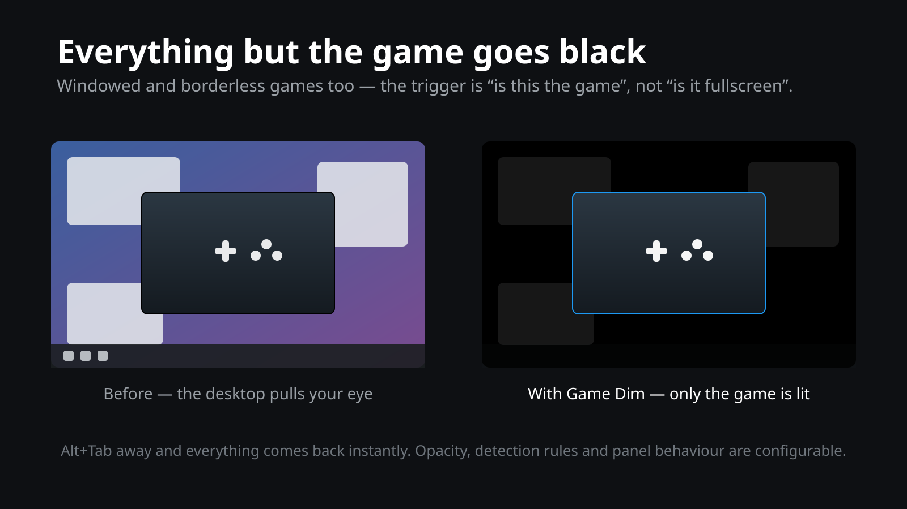

<div align="center">

# 🌑 Game Dim

### Everything around the game goes black, for KDE Plasma 6

Play a borderless or windowed game that doesn't cover the whole screen and the wallpaper, the panels and every other window drop to **10 % opacity**. KWin composites over black, so what's left around the game is darkness. Alt‑tab out and it all comes back, instantly.


[](https://store.kde.org/p/2368747/)



</div>

---

## ✨ What it does

- 🎮 **Windowed and borderless games too.** The trigger is not "is it fullscreen" but "is this the game" — a 3072×1728 window on a 6144×1728 desktop still gets the treatment. The bright wallpaper and the second monitor stop pulling your eye mid‑match.
- 🌑 **Black, not grey.** Nothing is painted on top: the surrounding windows are simply made transparent, and KWin's compositing floor is black. `0 %` gives you pure, measured‑at‑zero black.
- 🖥️ **The desktop counts as background.** The Plasma desktop window is dimmed like any other, so the wallpaper goes with it. Panels too, unless you'd rather keep them readable.
- 🧠 **Knows a game when it sees one.** Fullscreen, borderless, or a window class starting with `steam_app_`, `gamescope`, `lutris`, `heroic`. A Proton game is recognised without you configuring anything.
- ⚡ **Instant both ways.** Dimming is applied on activation and undone the moment you leave. Every window's original opacity is remembered individually and restored exactly — nothing is assumed to have been at 100 %.
- 🪟 **New windows join in.** A notification window or a launcher popping up mid‑game is dimmed as it appears, without re‑walking the window list.
- ⚙️ **Settings, not source edits.** Opacity, the two detection rules, the class list and the panel behaviour live in a proper config page in System Settings, applied live.
- ⌨️ **The switcher and the popups stay lit.** Alt+Tab's switcher is a KWin window like any other and would otherwise be dimmed into unreadability — it and KWin's other internal windows are left alone, and taking the focus doesn't count as leaving the game.
- 🖱️ **Hovering the task manager lifts the dimming.** A task‑manager preview is a live thumbnail of the window it mirrors, so it inherits that window's opacity — excluding the tooltip itself isn't enough. Open a preview or a panel menu and the dimming steps aside until you close it. Notifications, which open themselves, deliberately don't.
- 🔍 **Overview gets out of the way.** Open Overview, Present Windows or the Desktop Grid mid‑game and the dimming lifts for as long as they're on screen — a grid of black thumbnails is useless. It comes back when you drop into the game again.
- 🪶 **Signal‑driven.** The script sleeps until KWin says something happened; the only thing it has to watch rather than await is the effect above, and that watch only ticks while a game is running.

> 🖥️ **Companion script:** [**Fullscreen to New Desktop**](https://store.kde.org/p/2368744/) ([source](https://github.com/geodro/kde-fullscreen-spaces)) — the two split the problem rather than overlap: that one handles the window that *does* cover the screen, by giving it its own virtual desktop; this one handles the window that doesn't. On a multi‑monitor setup they stack — the game gets its own Space *and* the screen next to it goes black instead of showing an empty, bright desktop.

---

## 🤔 Why?

A game in *fullscreen windowed* or *borderless* mode at less than your display's resolution — because you want a stable frame rate, an ultrawide letterbox, or a second monitor you can still glance at — leaves a bright frame of desktop around it. KDE has no way to say "while I'm playing, everything else is off". Alt‑tabbing to a black wallpaper before each session is a ritual, not a feature.

---

## 📦 Installation

### Option A — one‑liner (recommended)

```bash
git clone https://github.com/geodro/kde-game-dim.git
cd kde-game-dim
./install.sh
```

### Option B — with `kpackagetool6`

```bash
kpackagetool6 --type KWin/Script --install .
kwriteconfig6 --file kwinrc --group Plugins --key gamedimEnabled true
qdbus6 org.kde.KWin /KWin reconfigure
```

### Enable it by hand

*System Settings* → *Window Management* → *KWin Scripts* → tick **Game Dim** → *Apply*.

### Uninstall

```bash
./uninstall.sh
```

---

## ⚙️ Configuration

**System Settings → Window Management → KWin Scripts → the ⚙ next to *Game Dim*:**

| Setting | Default | What it does |
|---|---|---|
| *Background opacity* | 10 % | How much of everything behind the game stays visible. `0 %` is pure black. |
| *Count as a game: borderless windows* | on | Any window without a frame is treated as a game. |
| *Count as a game: fullscreen windows* | on | Any fullscreen window is treated as a game. Turn this off if fullscreen video keeps dimming your second monitor. |
| *Window classes* | `steam_app_,gamescope,lutris,heroic` | Comma‑separated prefixes matched against the window class. |
| *Dim panels too* | on | Off keeps the Plasma panels at full opacity — useful if you watch a clock or a system‑monitor widget while playing. |

Changes apply immediately; no reload, no logout.

Settings are stored under `[Script-gamedim]` in `~/.config/kwinrc`, so they can also be scripted:

```bash
kwriteconfig6 --file kwinrc --group Script-gamedim --key Opacity 0
qdbus6 org.kde.KWin /KWin reconfigure
```

### Windowed games with a titlebar

A game running in a plain window with a titlebar is indistinguishable from any other application, so it has to be named. Run the command below, then click the game's window:

```bash
qdbus6 org.kde.KWin /KWin queryWindowInfo
```

Take `resourceClass` from the output — a prefix of it is enough — and add it to *Window classes*.

---

## 🧠 How it works

`isGame()` answers one question about the **active** window: fullscreen, borderless, or a configured class prefix. That's the whole policy; everything else is bookkeeping.

When a game becomes active, `enterGame()` walks the window list once, stores each window's current opacity under its `internalId`, and sets it to the configured value. Opacity is saved per window rather than assumed, so a window you had already made translucent comes back translucent, not opaque. The map is keyed by id and never by the window object — KWin's JS wrappers are not guaranteed to be the same instance between calls, so holding one is a quiet way to leak.

From then on it's four signals and nothing else. `windowActivated` re‑evaluates and either enters, switches, or leaves the dimmed state. `fullScreenChanged` and `minimizedChanged`, connected per window, handle a game that goes borderless or fullscreen *after* it is already focused. `windowAdded` dims the newcomer directly if a game is running — a single call, not a rescan — and `windowRemoved` drops its saved entry, ending the dim if the window that closed *was* the game. `options.configChanged` restores everything, re‑reads the settings and re‑evaluates, which is why the config page applies live.

One thing has to survive outside that map: KWin has no unload event, so reloading the script (or a KWin crash) while a game is running would strand windows at 10 % with nothing left to restore them — and, worse, the next load would record 10 % as their *normal* opacity, quietly turning undimming into a no‑op. So on startup anything still sitting at the dim level is recognised as our own leftover and put back to full, and a dim never saves a value already at or below the dim level.

Popups get the same treatment through ordinary signals: `windowAdded` counts anything that is a tooltip or a popup and isn't a notification, `windowRemoved` uncounts it, and while that count is above zero the dimming is suspended exactly as it is for Overview. Notifications are excluded on purpose — they open themselves, and one arriving mid‑match would throw the whole desktop back to full brightness.

One thing genuinely cannot be awaited. Overview, Present Windows and the Desktop Grid put every window on screen at once, and dimming through them shows a grid of black rectangles — but KWin publishes no signal for an effect starting, only the `workspace.isEffectActive()` query. Hanging that question on cursor movement almost works and then strands you: a game that locks the pointer emits nothing once Overview closes, so the dimming never returns. So a `QTimer` polls those three effects — started when a game becomes active, stopped the moment it isn't.

It polls every 20 ms, and that number is not paranoia. Overview composes its backdrop and its thumbnails from the frames it draws as it opens; catch it 250 ms late and you get a black hole with the dimming baked into the picture, even though every window's opacity was restored a fraction of a second later. Restoring before the first frames land is the whole job. Three string lookups per frame is nothing beside the game running next to it.

The global state is `gameKey`, the `suspended` flag for that suspension, and the saved‑opacity map.

---

## 🩹 Troubleshooting

- **Nothing happens.** Confirm the script is loaded:
  `qdbus6 org.kde.KWin /Scripting org.kde.kwin.Scripting.isScriptLoaded gamedim`
  If it says `false`, tick it in System Settings → KWin Scripts, or re‑run `./install.sh`.
- **My game isn't detected.** It's probably a windowed game with a titlebar — add its class (see above). Check what KWin thinks it is with `queryWindowInfo`.
- **Fullscreen video dims my other monitor.** That's the *fullscreen windows* rule doing its job. Turn it off and rely on borderless + the class list.
- **10 % doesn't look like 10 %.** It is — screenshots are in gamma‑encoded sRGB, where 10 % of light reads as roughly 35 % of the pixel value. Set the opacity to `0 %` if you want it gone entirely.
- **The desktop lights up when I open a menu.** By design: a task‑manager preview is a live thumbnail and inherits the opacity of the window it mirrors, so the only way to show it properly is to stop dimming while any popup or tooltip is open. It goes back the moment the popup closes.
- **A window stayed dimmed.** Disabling the script while a game is active leaves it that way: the KWin scripting API has no unload event to clean up in. Re‑enable it — it recognises its own leftovers on startup and restores them — or log out and back in.

---

## 📄 License

[MIT](LICENSE) © George Dumitrescu
